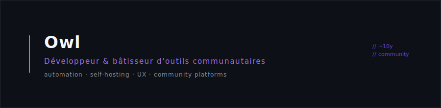

<p align="center">
  
</p>

<p align="center">
  
  
  
  
  
  
  
  
  
</p>

<p align="center">
  
</p>

### `~/ ce que je fabrique`

```text
infra & deploy    Docker + Ansible · self-hosting · reverse proxy · CI/CD
outils staff      modération · dashboards analytics · panels web
apps métier       automatisation qualité · centralisation données (WPF / .NET 8)
discord           bots réseau multi-serveurs · portails annuaires · panels
```

<p align="center">
  
</p>

### `~/ stats`

<p align="center">
  
  
</p>

<p align="center">
  
</p>
